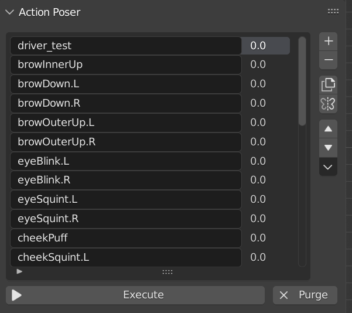
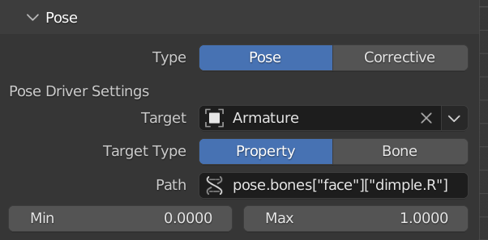
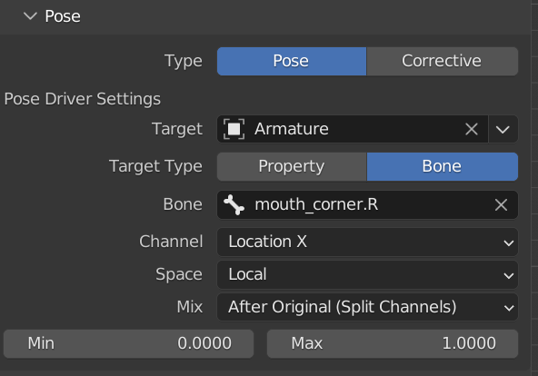
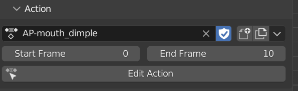
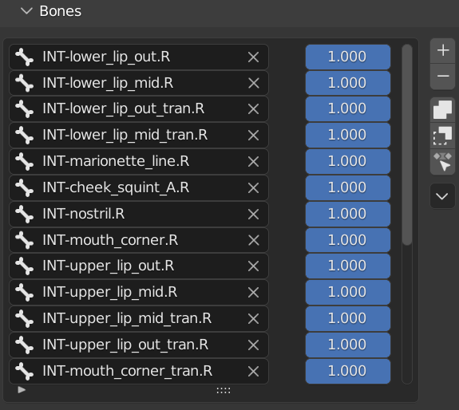

If you use GameRig and it saves you time or money, or if you would like to access a whole lot of rigging tutorials, consider joining my Patreon here:

# ActionPoser

ActionPoser is a rigging addon for Blender
Currently the main feature is creation of action constraint driven rigging.
A bone's transform channel or any other property can be used to drive action constraints.

> 

> ## Poses List
> This section contains the list of existing poses and has some useful operators to manipulate them.
> Hover over buttons to read what they do.
> 
> Execute - purges all existing poses and builds everything. Press this button whenever you make changes to the setup
> 
> Purge - removes all existing poses from the rig
> 
> 

> ## Poses
> Adjust what type of pose to create how it will be driven.
> Currently only the Pose type is supported, which is an action constraint driven setup.
>
>Target can be driven by a Bone, or a Property. For the property typ, paste any data path into the field. Must be a single value property, no vectors.
>Min and Max define at which range the pose will be activated
> 
>  

> ## Action
> Set and adjust target action values.
> Action will be played back in the range of star-end frame, based on the pose driver's min and max values
> When Edit Action is pressed, the armature state gets reset to remove any bone transformations that are not part of the action. Once editings is finished, press the button again to restore the state.
> 
>  

> ## Bones
> Here you can define which bones will be part of the pose.
> 
>  
